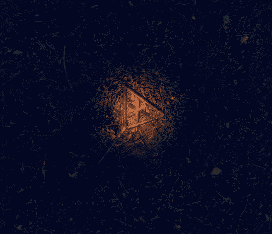

<h2>The Inculcation</h2>

The Inculcation is a mystery video game made using the Unity Engine. It follows a man who is on the lookout for his sister who vanished after she went for a grieveing session after her best friend's death. The game involves finding clues and uncovering what happened to her. 

The game is available to download for Windows 10/11 PCs and Xbox One/Series X devices for C$2.50 from the Microsoft Store. This is mostly just used as a donation scheme since the game is open-source; you can download the game for free on PC by downloading the zip file from Releases. The Store is the recommended way of getting it, since updates are automatic and you also get to suuport me :)

# Description
The game is built using Unity 2021.2. The game makes use of Unity's HDRP. The focus of the game is on its visuals, which were acheieved using Unity's High Definition Rendering Pipeline and some post-processing. My goal with this game was to explore visuals, animation and camera controls in Unity. The game can be played using both first-person and third-person perspectives. A huge chunk of the game takes place in one scene, with each terrain loading only when needed and unloading when the player is no longer on it. The third person camera uses a Cinemachine camera. The first bit of the game has some (sloppy) driving because I just wanted to learn how to do it. The game uses a couple of paid assets, mostly trees and vegetation.

# Screenshots
<table><tr>
<td>  </td>
<td>  </td>
<td>  </td>
<td>  </td>
</tr></table>

# Building
This project isn't really meant to be cloned and built by others, but if you wish to do so, please note that some of the assets in use are paid, and you will need to buy them in order to run this yourself. If you do want to contribute to this however, contact me and I will give you access to the assets. 
Steps to build and run this:
- Clone this repo
- Open Unity Hub and click Add
- Select the repo folder
- It will prompt you install the required Unity version. Install it
- You should now be able to launch the project in Unity. 

## Contribution guidelines
The classes in the project are divided into namespaces. Please put any classes you create in the appropriate namespaces. Try to follow Unity code convention when naming variables. Be sure to make reusable things Prefabs. 

# Music
The music for this game is composed by Drkblu. The music is not included in the repo as it is copyrighted. 
